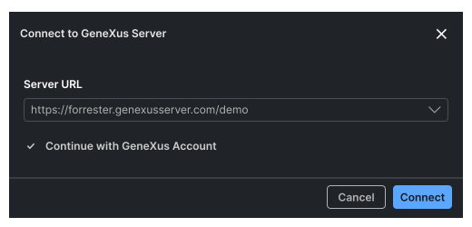
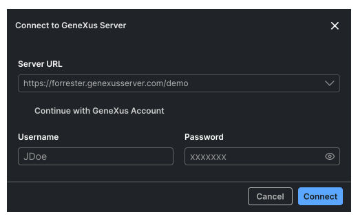

# gx-ide-connect-gx-server

Notas: Este modal es igual al paso correspondiente para el diálogo de Create KB. Idealmente reutilizar el mismo componente.

_conección con genexus account:_


Los campos que se pueden modificar en una primer instancia son:

**Server URL**
Combo-box con las URLs catalogadas de los GX Servers conocidos. El campo debe ser editable para permitir al usuario ingresar nuevas URLs

**Continue with GeneXus Account**:
El tener seleccionado este checkbox, indica que el usuario quiere utilizar la misma cuenta con la que se encuentra autenticado en el IDE web para establecer la conexión con el GXserver. El tener seleccionado este checkbox los campos de _Username_ y _Password_ quedan ocultos, ya que no son necesarios.

_conección con usuario y password:_


**Username y Password**

La conexión sin genexus account habilita y muestra los campos de _Username_ y _Password_.

Una vez que el usuario rellena estas opciones puede conectarse presionando el botón _Connect_ para iniciar la conexión.

## Properties

#### `serverUrls:string[]`

Array de URLs de servidores catalogados a mostrarse en el combo

#### `enableCustomServer:boolean`

`true` si se debe permitir al usuario ingresar manualmente una URL de servidor

#### `enableUserLogged:boolean`

`true` si el usuario ya se encuentra autenticado en el IDE Web.

- Si es `true` se debe mostrar habilitado y chequeado el checkbox Continue with GX Account
  El usuario puede des-seleccionar el checkbox y se debe permitir ingresar usuario y contraseña.

- Si es `false` Se tiene que mostrar deshabilitado y deschequeado y directamente ya mostrar las opciones para ingresar usuario y contraseña.

#### `defaultConnectionData?:GXServerConnectionDefault`

Valores iniciales de usuario para el caso en el que el usuario vuelva al modal de login luego de una autenticación exitosa.

#### `connectCallback:(data:GXServerConnectionData) => Promise<ConnectionResultData>`

Callback que debe ser invocado cuando se presiona el botón 'Connect'.

#### `cancelCallback:() => Promise<void>`

## Types

```
type GXServerConnectionDefault = {
    serverUrl: string; // URL de GXserver seleccionada
    user: string;
    password: string;
};
```

```
type GXServerConnectionData = GXServerConnectionDefault & {
    continueWithGeneXusAccount: boolean
};
```

```
type ConnectionResultData = {
success: boolean;
    [link text](#internal-id)
    errorMessages:[FormElementValidation](#internal-id)[];
};
```
